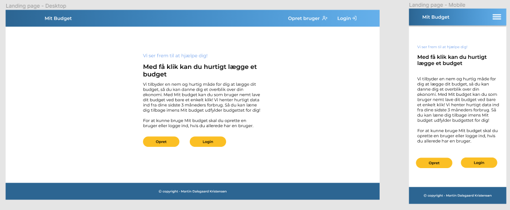
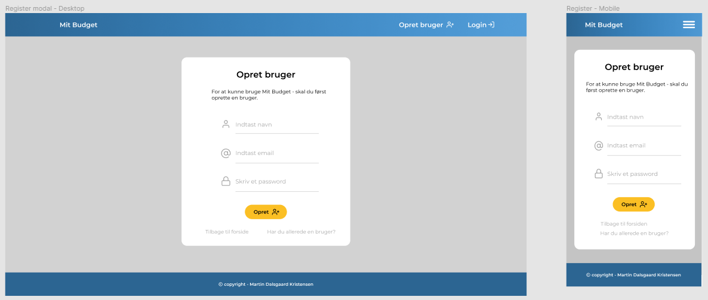
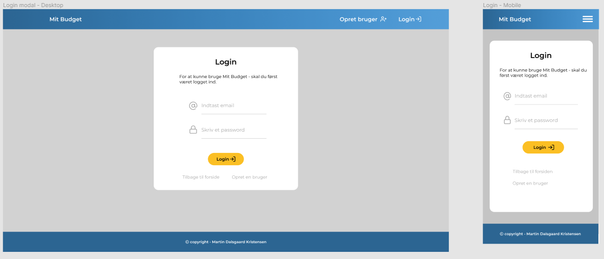

#BACHELOR PROJEKT: MIT BUDGET APP
**************************************************************

- This is my bachelor projekt for Web Development. 
- Its a fullstack webapplication made with PERN stack. 
(PostgreSQL, Express, React & Node.js) 

#SCREENSHOTS
**************************************************************

#HOW TO SETUP AND USE LOCALLY 
**************************************************************

1. Unzip the mit_budget_app folder. 

2. Make sure you have Node.js installed 
- https://nodejs.org/en/download/ 
- check the version after the installation: in terminal: [node -v] and [npm -v]. 
- You should have minmum version 14.16.0

3. run npm install in root folder, client folder and server folder. 

#START THE SERVER 
**************************************************************

1. Open a terminal. CommandPrompt/powershell (Windows) - Terminal (Mac)

2. cd into the mit_budget_app folder 

3. cd into the server folder

4. Run the command: nodemon server

Now the server is running in the terminal

#START THE FRONTEND
**************************************************************

1. Open a new terminal window - (DONT CLOSE THE TERMINAL THAT RUNS THE SERVER)

2. cd into the mit_budget_app folder

3. cd into the client folder

4. Run the command: npm start  

5. A localhost will start. Go to http://localhost:3000/home

**************************************************************
#DONE! 
**************************************************************
